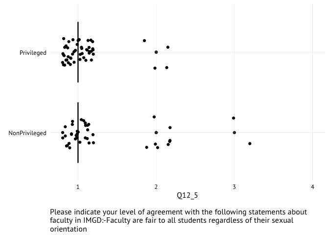
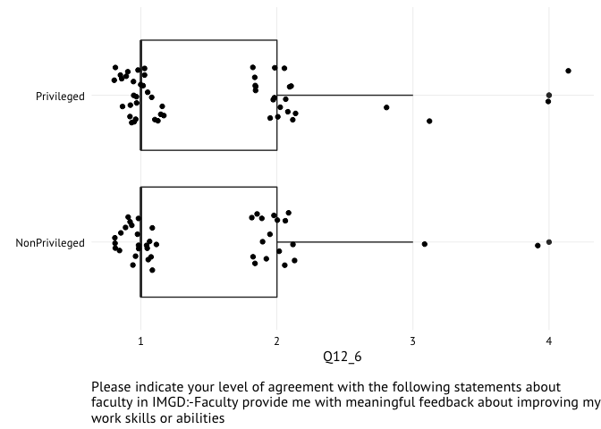
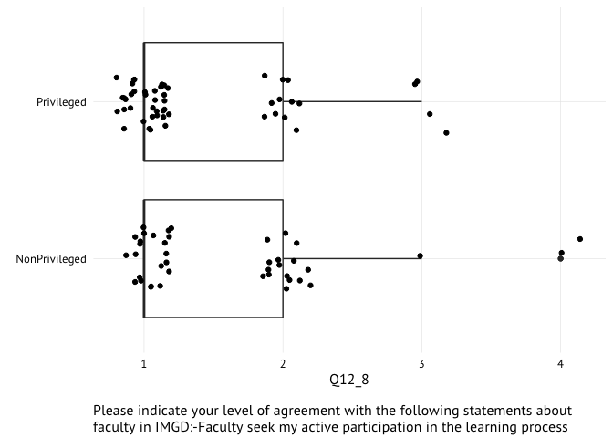
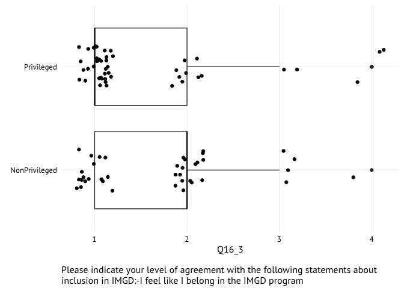
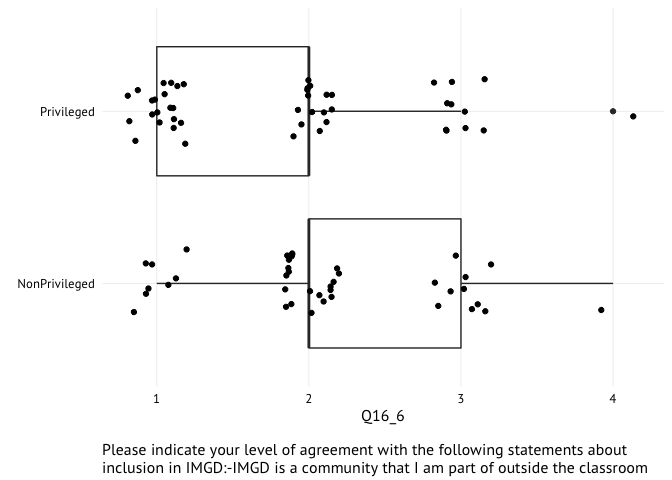

IMGD Climate Plots
================
@laneharrison
May 26, 2016

I re-plotted some of the IMGD Climate Survey.

The goal is to show the raw data in addition to the aggregate.

Each dot is a student's response.

Some questions led to varied responses-- these may be something we should at more closely.

Dividing by Majors
==================

    ## [1] IMGDMajor  IMGDcourse IMGDGrads 
    ## 5 Levels: {'ImportId': 'embeddedData-Source'} IMGDcourse ... Source

Dividing by Demographics
========================

Majors, Minors, Graduate Students (n = 91) Non-Majors (n = 53)

Comparison Groupings
====================

Privileged Male: White, Straight, Male AND IMGD Major, Minor, or Graduate Student

| Answer | Frequency | Percent | Cumulative Percent |
|--------|-----------|---------|--------------------|
| No     | 45        | 49.45   | 49.45              |
| Yes    | 46        | 50.55   | 100                |
| -      | -         | -       | -                  |
| Total  | 91        | 100     | 100                |

    ## 
    ## NonPrivileged    Privileged 
    ##            42            52

Perceptions of Faculty
======================

(`Q12_1` -- `Q12_11`)

<!-- --><!-- --><!-- --><!-- --><!-- --><!-- --><!-- --><!-- --><!-- --><!-- --><!-- -->

Index 2: Feel Safe In Class
===========================

(`Q14_1` -- `Q14_4`)

<!-- --><!-- --><!-- --><!-- -->

Index 3: Diverse Materials
==========================

(`Q15_1` -- `Q15_3`)

<!-- --><!-- --><!-- -->

Index 4: Inclusive of Difference
================================

<!-- --><!-- --><!-- --><!-- --><!-- -->

Index 5: Passionate Community
=============================

<!-- --><!-- --><!-- --><!-- --><!-- --><!-- -->

Index 6: Safety
===============

<!-- --><!-- --><!-- --><!-- --><!-- --><!-- --><!-- --><!-- --><!-- --><!-- -->
