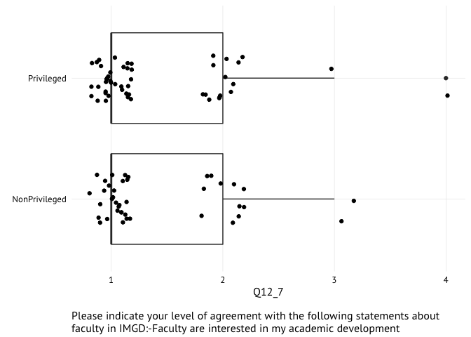
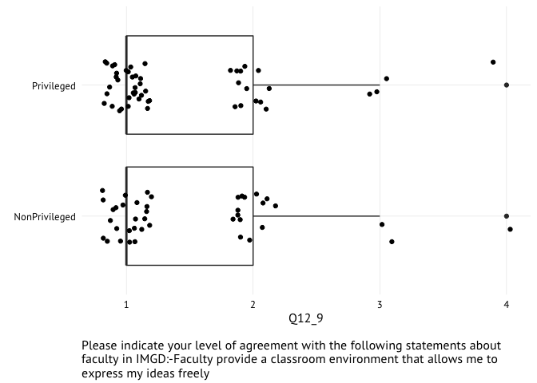

README
================
@laneharrison
May 26, 2016

service-imgd-climate is ...

``` r
master <- read.csv('data/data.csv')
source("fun.R")
```

    ## Warning: package 'ggplot2' was built under R version 3.2.4

    ## 
    ## Attaching package: 'dplyr'

    ## The following objects are masked from 'package:stats':
    ## 
    ##     filter, lag

    ## The following objects are masked from 'package:base':
    ## 
    ##     intersect, setdiff, setequal, union

    ## Loading required package: survival

    ## 
    ## Attaching package: 'boot'

    ## The following object is masked from 'package:survival':
    ## 
    ##     aml

    ## Loading required package: lpSolve

``` r
key <- master[c(0, 1), ]
data <- master[-c(1, 2), ]
```

Dividing by Majors
==================

Majors | minors | graduate students | non-majors - | - | - | - 67 | 13 | 11 | 53

``` r
unique(data$Source)
```

    ## [1] IMGDMajor  IMGDcourse IMGDGrads 
    ## 5 Levels: {'ImportId': 'embeddedData-Source'} IMGDcourse ... Source

``` r
data$IMGDStatus <- ifelse(data$Q9_1==1, "Major",
                   ifelse(data$Q9_2==1, "Major",
                   ifelse(data$Q9_3==1, "Minor",
                   ifelse(data$Q9_4==1, "NonMajor",
                   ifelse(data$Q9_5==1, "NonMajor",
                   ifelse(data$Q8==5, "Graduate",
                          NA ))))))

# table(data$IMGDStatus)
```

Dividing by Demographics
========================

Majors, Minors, Graduate Students (n = 91) Non-Majors (n = 53)

<table style="width:25%;">
<colgroup>
<col width="2%" />
<col width="2%" />
<col width="2%" />
<col width="2%" />
<col width="2%" />
<col width="2%" />
<col width="2%" />
<col width="2%" />
<col width="2%" />
</colgroup>
<thead>
<tr class="header">
<th align="left">LGBTQ</th>
<th align="left">Male</th>
<th align="left">Only White/Caucasian</th>
<th align="left">Only Black/African American</th>
<th align="left">Hispanic</th>
<th align="left">Only American Indian/Alaskan Native</th>
<th align="left">Only Other Race</th>
<th align="left">More than One Race</th>
<th align="left">First Generation College Students</th>
</tr>
</thead>
<tbody>
<tr class="odd">
<td align="left">24.44</td>
<td align="left">75.82</td>
<td align="left">72.53</td>
<td align="left">2.2</td>
<td align="left">5.49</td>
<td align="left">0.00</td>
<td align="left">16.48</td>
<td align="left">0.00</td>
<td align="left">0.00</td>
</tr>
<tr class="even">
<td align="left">7.55</td>
<td align="left">58.49</td>
<td align="left">64.15</td>
<td align="left">1.89</td>
<td align="left">11.32</td>
<td align="left">0.00</td>
<td align="left">18.87</td>
<td align="left">0.00</td>
<td align="left">1.89</td>
</tr>
</tbody>
</table>

Comparison Groupings
====================

Privileged Male: White, Straight, Male AND IMGD Major, Minor, or Graduate Student

| Answer | Frequency | Percent | Cumulative Percent |
|--------|-----------|---------|--------------------|
| No     | 45        | 49.45   | 49.45              |
| Yes    | 46        | 50.55   | 100                |
| -      | -         | -       | -                  |
| Total  | 91        | 100     | 100                |

``` r
data$Privileged <- 
    ifelse( 
      (data$IMGDStatus=="Major" | data$IMGDStatus=="Minor" | data$IMGDStatus=="Graduate") & 
      (data$Q4_1==1 & data$Q5==2 & data$Q1_1==1), "Privileged", 
    ifelse(
      (data$IMGDStatus=="Major" | data$IMGDStatus=="Minor" | data$IMGDStatus=="Graduate"), "NonPrivileged", 
    NA))

table(data$Privileged)
```

    ## 
    ## NonPrivileged    Privileged 
    ##            42            52

Perceptions of Faculty
======================

(`Q12_1` -- `Q12_11`)

``` r
index <- c(
 "Q12_1",
 "Q12_2",
 "Q12_3",
 "Q12_4",
 "Q12_5",
 "Q12_6",
 "Q12_7",
 "Q12_8",
 "Q12_9",
 "Q12_10",
 "Q12_11"
)

xform <- function(d, V) {
d <- d[grep("^\\d+$", d[,V]),,drop=F]
d[,V] <- as.numeric(as.character(d[,V]))
return(d)
}

for (V in index){
  data <- xform(data, V)
}

#data <- xform(data, "Q12_1")
#data <- xform(data, "Q12_2")
#data <- xform(data, "Q12_3")
#data <- xform(data, "Q12_4")
#data <- xform(data, "Q12_5")
#data <- xform(data, "Q12_6")
#data <- xform(data, "Q12_7")
#data <- xform(data, "Q12_8")
#data <- xform(data, "Q12_9")
#data <- xform(data, "Q12_10")
#data <- xform(data, "Q12_11")

bplot <- function(V) {
  p <- ggplot(data, aes_string("Privileged", V))
  p <- p + geom_boxplot() + geom_jitter()
  p <- p + expand_limits(y = c(0,6))
  p <- p + coord_flip()
  p <- p + theme_bw()
  p <- p + theme(plot.title=element_text(hjust=0))
  p <- p + theme(panel.border=element_blank())
  p <- p + theme(panel.grid.minor=element_blank())
  p <- p + theme(axis.ticks=element_blank())
  p <- p + theme(legend.key=element_rect(color="white"))
  p <- p + theme(text=element_text(family="Avenir Next Medium"))
  p
}

bplot("Q12_1")
```

    ## Warning: Removed 51 rows containing non-finite values (stat_boxplot).

    ## Warning: Removed 51 rows containing missing values (geom_point).

<!-- -->

``` r
bplot("Q12_2")
```

    ## Warning: Removed 51 rows containing non-finite values (stat_boxplot).

    ## Warning: Removed 51 rows containing missing values (geom_point).

<!-- -->

``` r
bplot("Q12_3")
```

    ## Warning: Removed 51 rows containing non-finite values (stat_boxplot).

    ## Warning: Removed 51 rows containing missing values (geom_point).

<!-- -->

``` r
bplot("Q12_4")
```

    ## Warning: Removed 51 rows containing non-finite values (stat_boxplot).

    ## Warning: Removed 51 rows containing missing values (geom_point).

<!-- -->

``` r
bplot("Q12_5")
```

    ## Warning: Removed 51 rows containing non-finite values (stat_boxplot).

    ## Warning: Removed 51 rows containing missing values (geom_point).

<!-- -->

``` r
bplot("Q12_6")
```

    ## Warning: Removed 51 rows containing non-finite values (stat_boxplot).

    ## Warning: Removed 51 rows containing missing values (geom_point).

<!-- -->

``` r
bplot("Q12_7")
```

    ## Warning: Removed 51 rows containing non-finite values (stat_boxplot).

    ## Warning: Removed 51 rows containing missing values (geom_point).

<!-- -->

``` r
bplot("Q12_8")
```

    ## Warning: Removed 51 rows containing non-finite values (stat_boxplot).

    ## Warning: Removed 51 rows containing missing values (geom_point).

<!-- -->

``` r
bplot("Q12_9")
```

    ## Warning: Removed 51 rows containing non-finite values (stat_boxplot).

    ## Warning: Removed 51 rows containing missing values (geom_point).

<!-- -->

``` r
bplot("Q12_10")
```

    ## Warning: Removed 51 rows containing non-finite values (stat_boxplot).

    ## Warning: Removed 51 rows containing missing values (geom_point).

<!-- -->

``` r
bplot("Q12_11")
```

    ## Warning: Removed 51 rows containing non-finite values (stat_boxplot).

    ## Warning: Removed 51 rows containing missing values (geom_point).

<!-- -->
